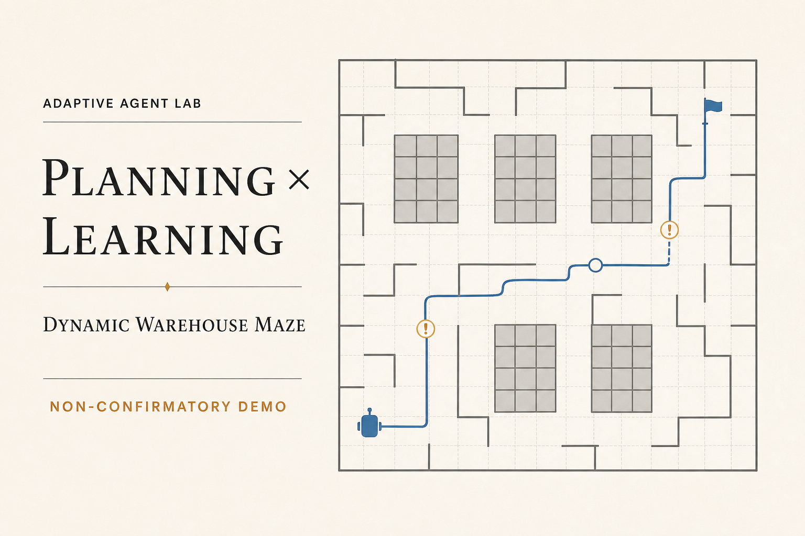

# Adaptive Agent Lab

[](https://github.com/Revincxt/adaptive-agent-lab/actions/workflows/ci.yml)
[](https://www.python.org/)
[](https://revincxt.github.io/adaptive-agent-lab/)

[](https://revincxt.github.io/adaptive-agent-lab/)

**A reproducible laboratory for planning, reinforcement learning, and hybrid
agents in dynamic single-robot warehouse delivery.**

> **[Open the multi-map replay explorer →](https://revincxt.github.io/adaptive-agent-lab/)**
> Inspect six controllers across four structured warehouse layouts. Each case
> is an independent non-confirmatory demonstration, not evidence of an
> algorithm ranking.

Adaptive Agent Lab compares six agent families against the same deterministic
simulator and seeded dynamic scenarios:

- open-loop A* planning;
- state-triggered A* replanning;
- exact tabular Q-learning;
- Dyna-Q with a learned one-step model;
- a dependency-light NumPy DQN; and
- a learned high-level option selector with A* routing.

> **Status: alpha.** The simulator, scenario generator, six agents, paired
> benchmark runner, machine-readable artifacts, and replay-data exporter are
> implemented and tested. The frozen training/checkpoint pipeline required for
> confirmatory research claims is not implemented yet.

## What is implemented

| Agent | Current implementation |
| --- | --- |
| `planning` | Builds one A* pickup/drop-off plan from orders available at reset and never repairs it. |
| `replanning` | Rebuilds its current A* route when closures, order status, carried order, or immediate action feasibility changes. |
| `q-learning` | Masked one-step Q-learning over an exact hashable state. |
| `dyna-q` | The same Q-learning update plus uniformly sampled updates from the latest observed deterministic model entry. |
| `dqn` | Masked standard DQN with a NumPy MLP, ReLU hidden layers, selected-action MSE, plain SGD, replay, and a periodically copied target network. |
| `hybrid` | Semi-MDP Q-learning over per-order, charge, and wait options; A* emits primitive movement and service actions. |

The action strings are exactly `up`, `down`, `left`, `right`, `pickup`,
`dropoff`, `charge`, and `wait`.

The neural encoder is a flat vector, not a convolutional tensor. It contains
four grid channels (obstacles, charging stations, dynamic blockages, and the
robot), three global values, and 12 values for each padded order slot. See
[`docs/problem-formulation.md`](docs/problem-formulation.md) for the complete
state and reward contract.

## Quick start

```bash
python -m venv .venv
source .venv/bin/activate
python -m pip install -e '.[dev]'

aal scenario show scenarios/small/dynamic-demo.json
aal run --agent replanning --scenario scenarios/small/dynamic-demo.json --seed 42
```

Generate another deterministic scenario:

```bash
aal scenario generate scenarios/small/example.json \
  --size small --dynamics medium --orders 4 --horizon 180 --seed 42
```

Train one learner on one scenario and save its JSON state:

```bash
aal train --agent dyna-q \
  --scenario scenarios/small/dynamic-demo.json \
  --episodes 100 \
  --output models/dyna-q-demo.json
```

Run a small paired planning smoke benchmark:

```bash
aal benchmark \
  --config configs/benchmarks/main.json \
  --agents planning,replanning \
  --quick 2 \
  --output runs/smoke
```

Export the four-case trajectory gallery for the browser replay:

```bash
aal export-gallery \
  --config configs/demo-gallery.json \
  --output web/public/demo-data.json \
  --seed 42
```

The gallery records this root seed and scenario fingerprints in its provenance.
Decision timing is intentionally not collected for these portable demo tapes;
the interface reports it as unmeasured rather than as a synthetic zero.

Inspect the interactive replay locally (Node.js 22.13+ and pnpm):

```bash
cd web
pnpm install
pnpm dev
```

Run `aal --help` or a subcommand's `--help` for the authoritative CLI options.

## Evidence labels

The committed browser data and data produced by `aal export-gallery` or
`aal export-demo` are
**non-confirmatory demonstrations**. They train learners for small convenience
budgets on the same scenario later used for display. They are useful for
checking behavior and replay rendering, but they are not held-out evidence and
must not be presented as an algorithm ranking.

The current `aal benchmark` creates fresh agents and does not load training
configs or checkpoints. Its default planning-only run is a reproducibility
smoke test. Explicitly selecting `q-learning`, `dyna-q`, `dqn`, or `hybrid`
evaluates an untrained learner; the CLI warns that it is a non-confirmatory
smoke test. Treat those outputs as `UNTRAINED SMOKE`, not as benchmark results.

The intended release study is pre-specified in
[`docs/experiment-protocol.md`](docs/experiment-protocol.md). It becomes
eligible for confirmatory language only after checkpoint-aware evaluation,
split isolation, multi-seed training, and the listed integrity gates exist.

## Repository map

```text
src/adaptive_agent_lab/
├── environment/     # contracts, events, simulator, generator, encoders
├── agents/          # planning, tabular, DQN, and hybrid agents
├── learning/        # NumPy MLP and replay buffer
├── benchmarking/    # paired runs, summaries, and artifact writing
├── reporting/       # canonical JSON and replay-data export
├── cli.py           # command-line entry point
└── randomness.py    # stable named seed derivation

configs/             # protocol and benchmark JSON
scenarios/           # canonical scenario fixtures
tests/               # unit, contract, integration, and determinism tests
docs/                # formulation, architecture, and research protocol
web/                 # browser replay application
```

## Verification

```bash
python -m pytest
python -m ruff check .
python -m mypy src
```

All benchmark claims should cite the run manifest and machine-readable summary,
and should state whether the run was a smoke test, demonstration, exploratory
study, or confirmatory release run.

## Scope

Version 0.2 retains the v0.1 environment model: one fully observable robot,
discrete time, one carried order, deterministic primitive action effects,
dynamic order availability, and temporary cell blockages. Multi-robot
coordination, partial observability, continuous control, and real warehouse
integrations are out of scope.

## License

[MIT](LICENSE)
