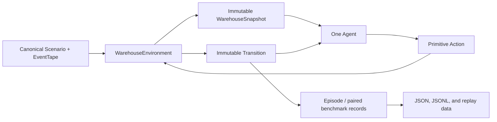

# Architecture

## Material Passport

- Origin skill: `experiment-agent`
- Origin mode: `plan`
- Origin date: 2026-08-05
- Verification status: **IMPLEMENTATION-ALIGNED; EMPIRICAL RESULTS UNVERIFIED**
- Version label: `architecture-v0.1`

This document describes the code that exists in v0.1 and separately lists the
research infrastructure that remains planned.

## Implemented system shape



`WarehouseEnvironment` is the sole transition authority. Agents receive an
immutable snapshot, return one `Action`, and may learn only from the resulting
immutable `Transition`. They never mutate simulator state directly.

## Package responsibilities

```text
src/adaptive_agent_lab/
├── environment/
│   ├── contracts.py     immutable positions, orders, states, actions, results
│   ├── events.py        canonical dynamic events and EventTape
│   ├── scenario.py      strict scenario JSON serialization
│   ├── simulator.py     deterministic transition implementation
│   ├── generator.py     seeded maps, orders, arrivals, and blockages
│   ├── observation.py   neural vector, exact tabular state, action mask
│   ├── rewards.py       RewardScheme coefficients
│   └── validation.py    independent state/transition/episode audit
├── agents/
│   ├── base.py          common lifecycle and diagnostics
│   ├── planning.py      A*, open-loop planning, and replanning
│   ├── tabular.py       Q-learning and Dyna-Q
│   ├── dqn.py           masked standard DQN
│   └── hybrid.py        learned semi-MDP options with A* routing
├── learning/
│   ├── network.py       NumPy MLP with manual backpropagation
│   └── replay.py        seeded replay buffer
├── benchmarking/
│   ├── runner.py        episode execution and operational metrics
│   ├── statistics.py    bootstrap summaries and paired differences
│   └── suite.py         condition expansion, paired runs, artifacts
├── reporting/
│   ├── artifacts.py     canonical JSON, fingerprints, atomic writes
│   └── demo.py          non-confirmatory browser replay export
├── cli.py               command routing
└── randomness.py        stable seed derivation
```

There is no separate `domain/` package in the current tree; immutable domain
contracts live in `environment/contracts.py`.

## Executable contracts

The effective lifecycle is:

```python
agent.reset(snapshot, seed=seed)
while not environment.state.terminated:
    action = agent.act(environment.snapshot, explore=False)
    result = environment.step(action)
    agent.observe(environment.history[-1])
agent.end_episode(environment.snapshot)
```

`run_episode` controls `learning_enabled` separately from `explore`, measures
decision time when requested, and produces one `EpisodeResult`. The environment
returns the selected action unchanged in `StepResult`, even if that action is
invalid. An invalid action has no service or movement effect, advances time,
records a typed violation, and receives the step plus invalid-action costs.

The independent validation module audits saved states and transitions without
calling the simulator, providing a second path for detecting corrupt records.

## Scenario and event flow

A `Scenario` contains the map, every order record, the initial robot, the event
tape, the horizon, and battery capacity. JSON loading rejects unknown or missing
keys. Orders and events are canonically sorted.

At reset, the environment applies events at time 0. Each subsequent step:

1. reads the current snapshot at time `t`;
2. applies the chosen action;
3. advances to `t + 1`;
4. applies all events scheduled for `t + 1`; and
5. publishes the next snapshot and transition.

Event kinds are `order_arrival`, `cell_blocked`, and `cell_unblocked`. Agents do
not receive the `EventTape` object, but all order definitions—including pending
orders and their release times—are part of `WarehouseSnapshot`. The current
problem is therefore fully observable with respect to order metadata and has no
future blockage lookahead.

`generate_scenario` uses independently derived streams for geometry, orders,
and dynamic events. Benchmark condition seeds exclude agent identity, so every
agent in a paired condition receives byte-equivalent scenario content.

## Observation representations

`ObservationSpec` fixes map width, height, maximum order slots, battery
capacity, horizon, and the maximum order priority.

### Neural vector

`ObservationEncoder.vector` returns a flat, padded vector with size

```text
4 * width * height + 3 + 12 * max_orders
```

The four flattened grid channels are permanent obstacles, charging stations,
active dynamic blockages, and robot position. The three globals are normalized
time, normalized battery, and a carrying flag. Each order slot has normalized
pickup and drop-off coordinates (four values), release time, deadline, priority,
and a five-way one-hot status. Unused order slots remain zero.

Both DQN and the hybrid agent use this vector. It is not an 8-channel tensor,
does not pad every map to 20 x 20, and is not processed by a convolutional
network.

### Exact tabular state

`ObservationEncoder.tabular` returns the exact tuple

```text
(time, robot_cell_index, battery, carried_order_index,
 order_status_code..., dynamic_blockage_bitmask)
```

The immutable map and order definitions are fixed episode context. No battery,
distance, deadline, direction, or order-count binning is used.

### Shared action mask

The encoder also produces a Boolean mask over the eight actions. Q-learning,
Dyna-Q, DQN, and the hybrid agent use it to avoid immediately invalid actions.
The simulator still validates every selected action independently.

## Agent implementations

- **Open-loop planning** orders only currently available orders by earliest
  deadline, then priority, distance, and order ID. It plans once at reset.
- **Replanning** uses the same ordering and A*. Its context contains active
  blockages, all order statuses, and the carried order; it also checks whether
  the next cached action remains valid.
- **Q-learning** uses masked one-step off-policy TD updates and a multiplicative
  epsilon schedule over the exact tabular state.
- **Dyna-Q** stores the latest observed result for each state-action pair and
  uniformly samples known pairs for `planning_steps` extra Q updates.
- **DQN** has an online NumPy MLP and a copied target MLP. Hidden layers use
  ReLU; the output is linear. It minimizes selected-action mean squared TD error
  with plain SGD and optional global gradient-norm clipping. Bootstrap values
  are the masked maximum from the target network. This is standard DQN, not
  Double DQN, and it does not use Adam or Huber loss.
- **Hybrid** learns semi-MDP Q values for one option per order plus charge and
  wait. The same NumPy MLP is updated with selected-option MSE/SGD when an option
  ends. A* converts active order or charge options into primitive actions and
  repairs routes when the blockage signature changes. There is no separate
  hand-coded task-selection fallback in the current implementation.

## Benchmark and artifacts

`BenchmarkSuite` expands configured map, dynamics, load, and tape-index cells.
For each cell it generates one scenario, rotates agent execution order, derives
agent-specific policy seeds, and runs the supplied factories against that same
scenario. The implemented writer emits:

```text
<output>/
├── manifest.json
├── episodes.jsonl
└── summary.json
```

The manifest records the suite, root seed, package version, scenario seeds and
fingerprints, execution order, and config fingerprint. Episode rows include
conditions, agent seeds, metrics, diagnostics, and violation counts. The summary
contains bootstrap summaries and configured paired differences.

The current runner does **not** load `training_config` entries or checkpoints.
`aal benchmark` therefore defaults to fresh planning agents. Selecting a learning
agent creates an untrained learner and is a smoke test only.

The demo exporter performs small convenience training budgets on a single
scenario and then exports paired replay traces. Its output is explicitly
non-confirmatory and is not a held-out benchmark.

## Configuration status

`configs/training/*.json` are single-scenario reference settings that match
current constructor, encoder, action, network, and reward semantics. They are
not the complete frozen release-training protocol. The current `aal train`
command accepts explicit CLI arguments and does not execute those files as
configs.

`configs/benchmarks/main.json` is loadable by `BenchmarkSuite`. Only its
executable subset—condition dimensions, seeds, primary metric, bootstrap
settings, comparisons, and three artifact names—is consumed today. Training
config references remain protocol metadata until checkpoint-aware factories are
implemented.

## Remaining release infrastructure

These are plans, not current capabilities:

- config-driven multi-seed training and validation checkpoint selection;
- persisted fixed observation/option specifications so neural policies can be
  evaluated across declared order-load conditions;
- checkpoint loading and within-tape aggregation of independent learned seeds;
- enforced train/validation/test root isolation;
- decision and episode timeout outcomes;
- compressed trajectory and anomaly artifacts for release benchmarks;
- full environment, dependency, git, and checkpoint provenance; and
- a frozen confirmatory run satisfying the experiment protocol.

Until those gates land, smoke and demo outputs must retain non-confirmatory
labels.
